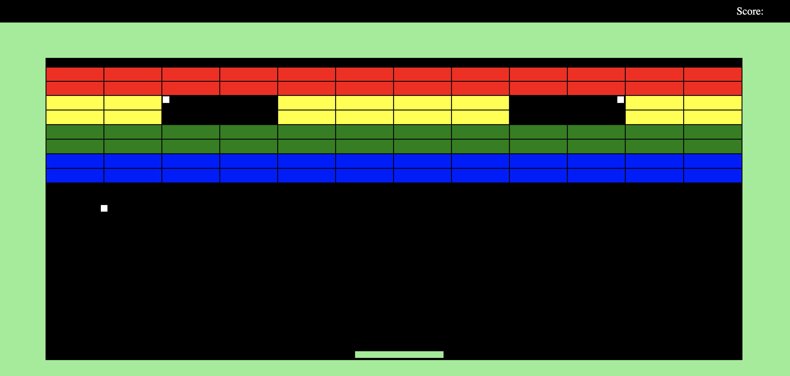
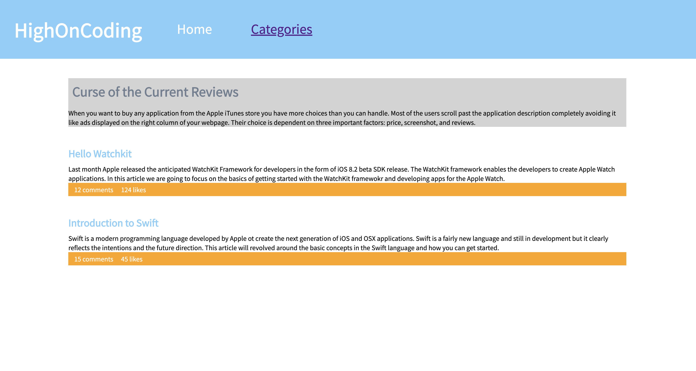
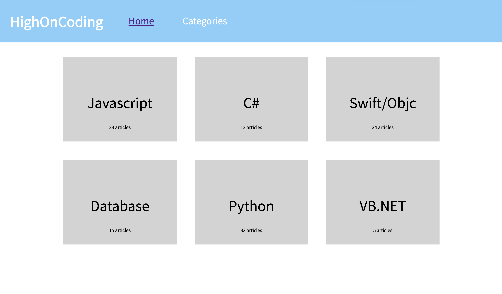
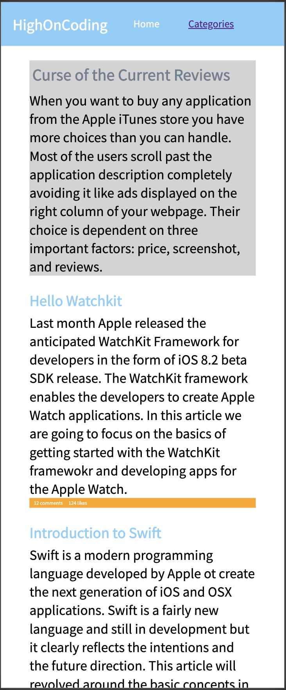
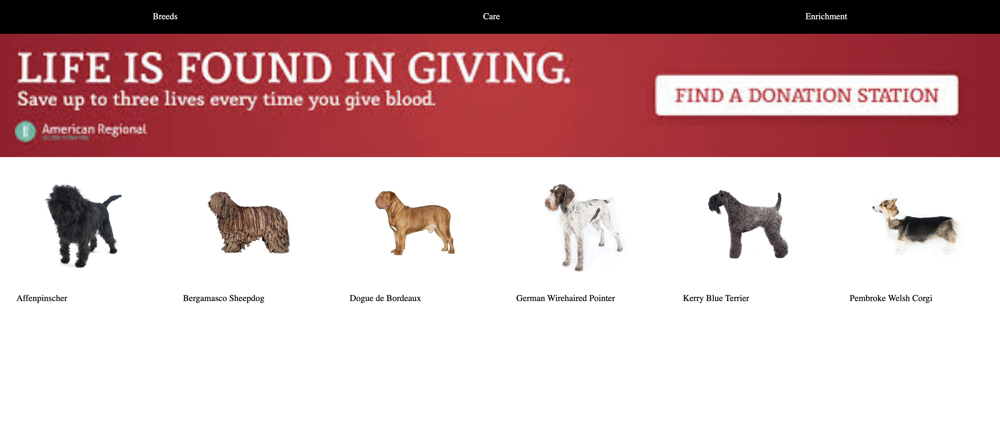
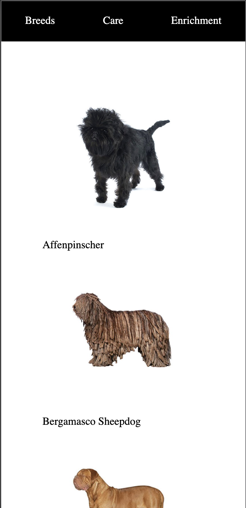
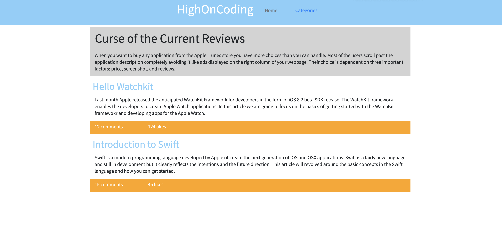
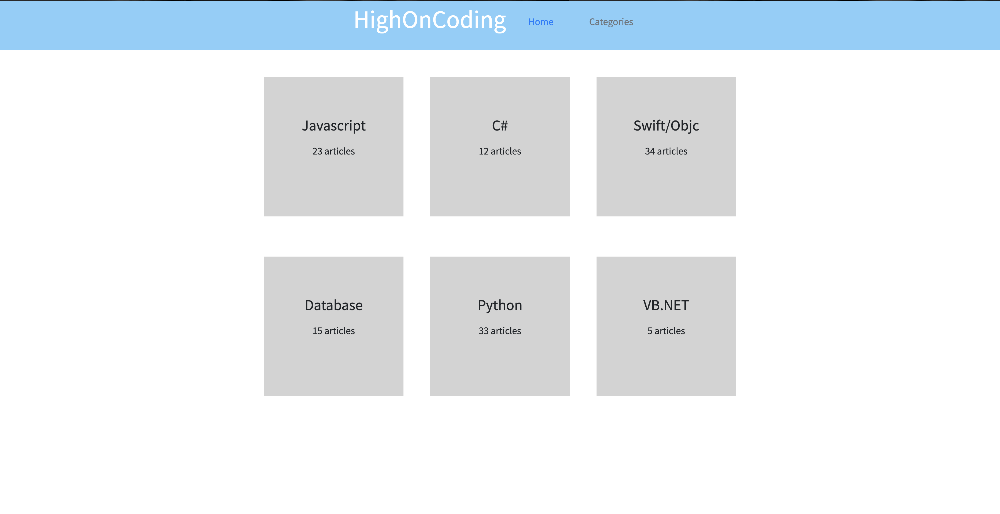
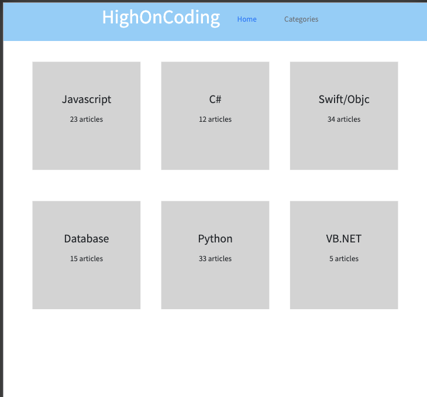

HTML and CSS assignments for Week 3 of DigitalCrafts

We were asked to design a basic 90s website on Day 1:

Copied a bricks game screenshot on Day 2:

Optional Day 2 assignment:

We were asked to make a basic responsive website on Day 3:

We were asked to do the same website from the optional Day 2 assignment in Bootstrap on Day 4:

I also did the optional Day 4 hard assignment - see the readme in Day4/old_wall_570