<h1> Week 3 DigitalCrafts Full-Stack Immersive </h1>

 - Coursework on HTML and CSS. It contains assignments and files from Week 3.  

<h2> Summary </h2>

  - [Screenshots](#screenshots)
  - [Acknowledgments](#acknowledgments)

## Screenshots

**Week 3 Day 1 - 90's Website**

- We were asked to design a basic 90s website on Day 1:

**Week 3 Day 2 - Copying 2 Static Pages**

- The prompt was to copy a bricks game screenshot:

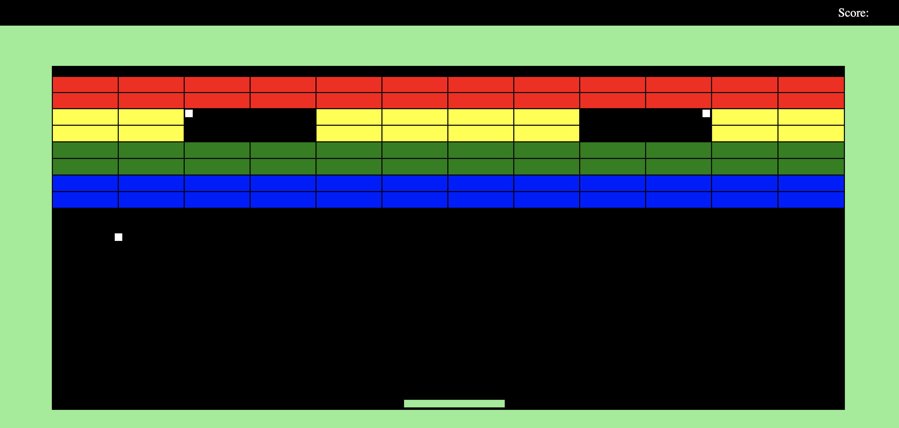

- The optional Day 2 assignment was to copy the High on Coding website:

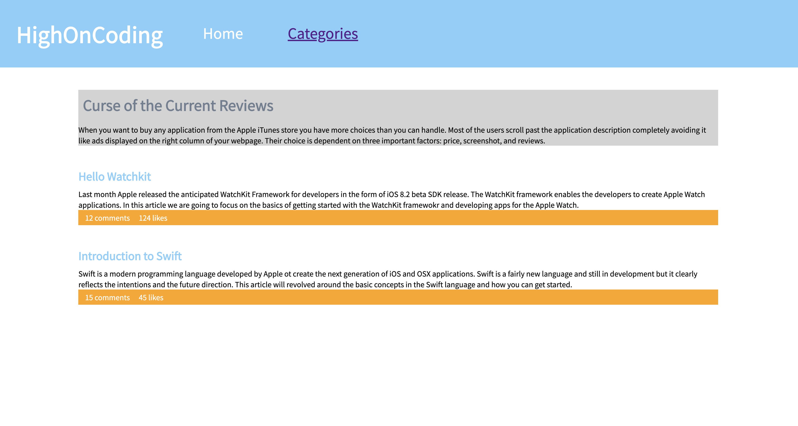

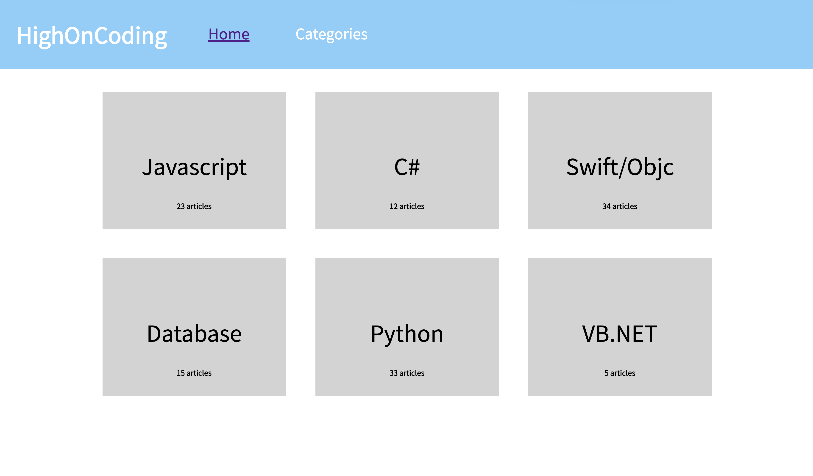

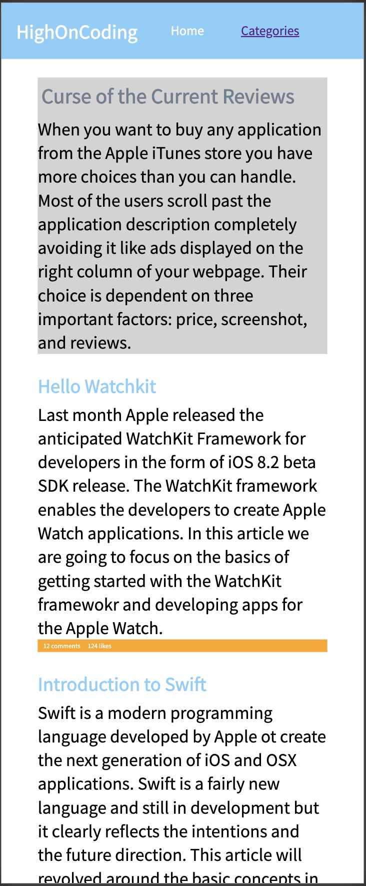

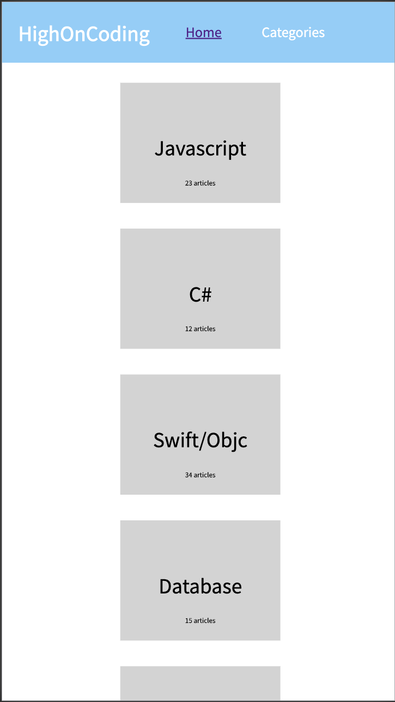

**Week 3 Day 3 - Basic Reponsive Website**

- The prompt was to make a basic responsive website:

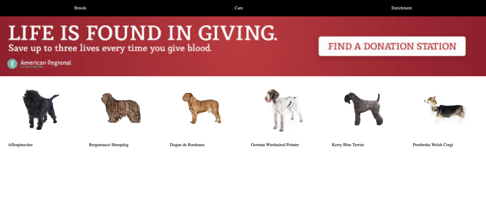

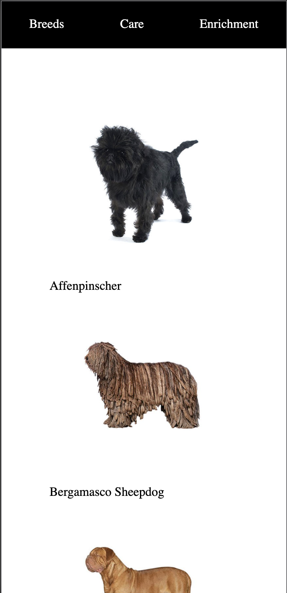

**Week 3 Day 4 - Bootstrap**

- The prompt was to make the same website from the optional Day 2 assignment in Bootstrap

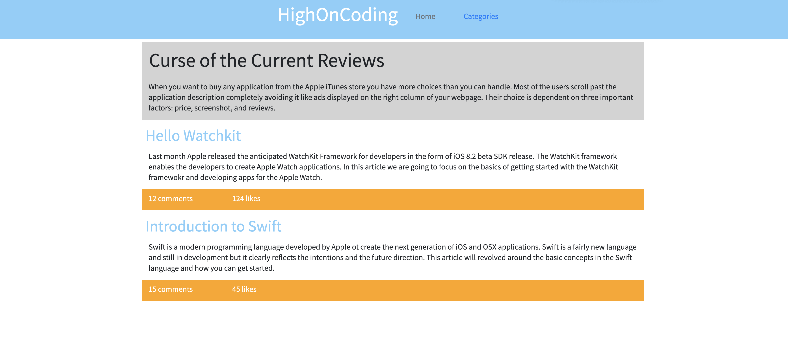

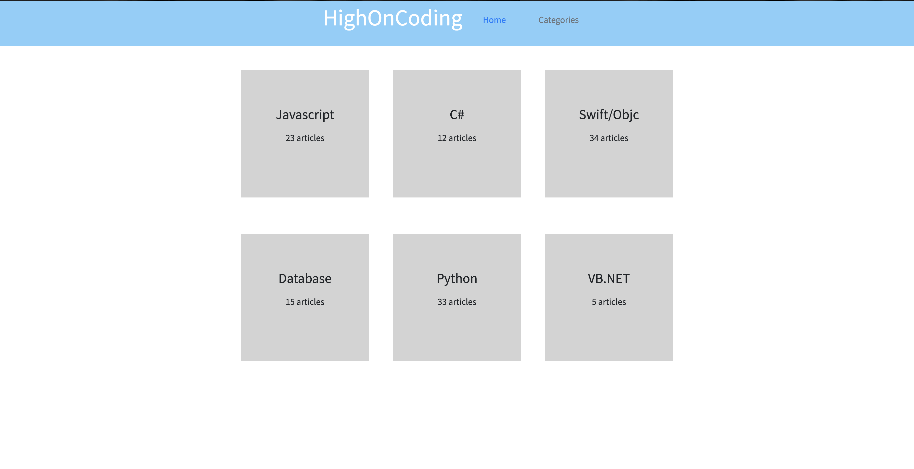

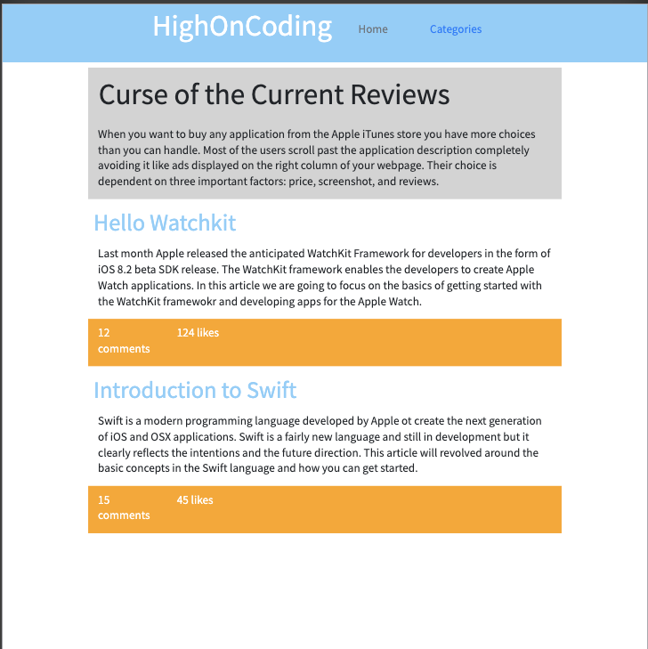

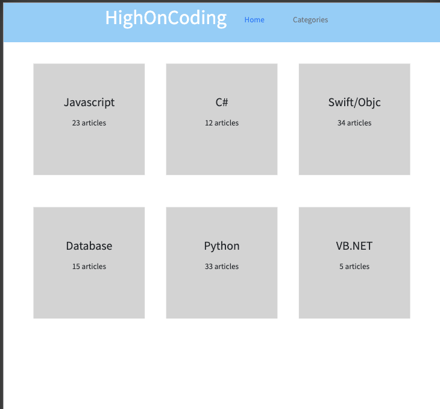

- I also did the optional Day 4 hard assignment - see the original code for the website in Day4/old_wall_570/original
- Prompt: Download the original website and make it responsive for mobile. Original files included in this repository.

*Original:*
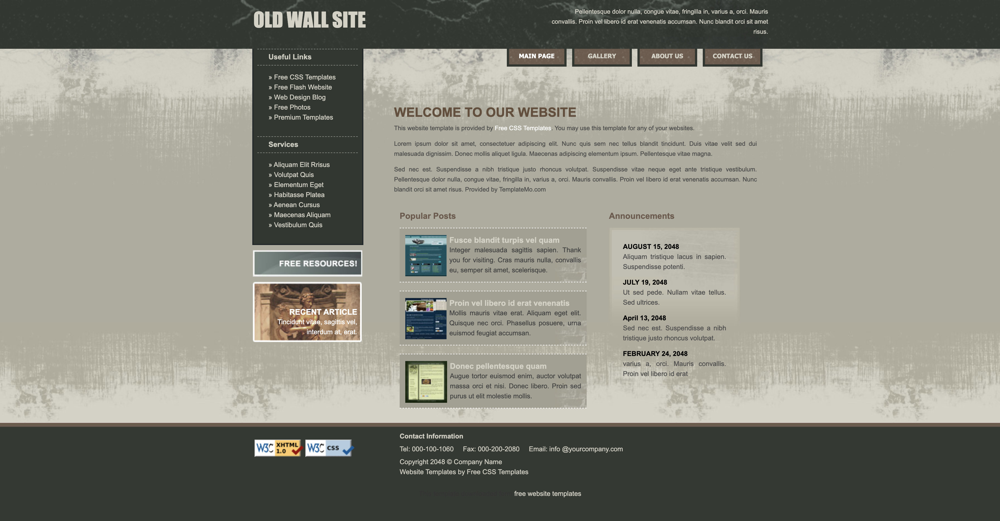

*Matching original in desktop view (9/26/20):*
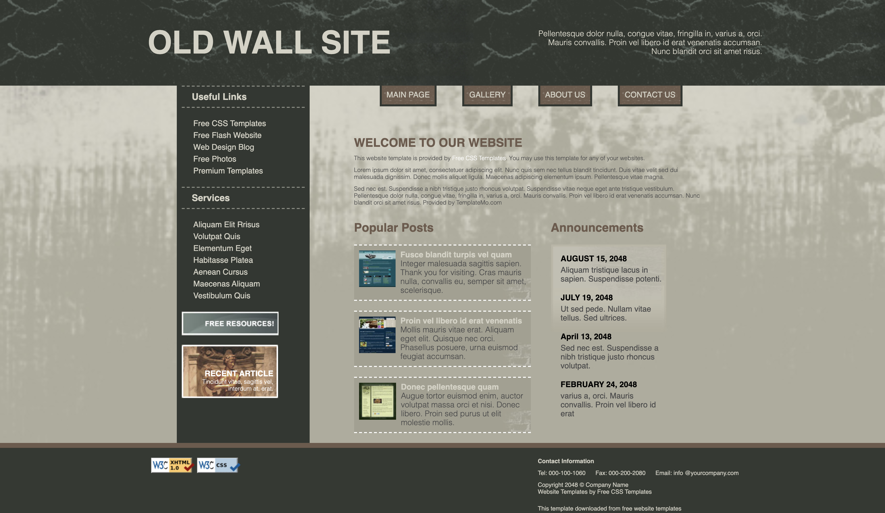

*Current mobile screenshots:*

- New background image from rawpixel.com

*Current tablet screenshot:*
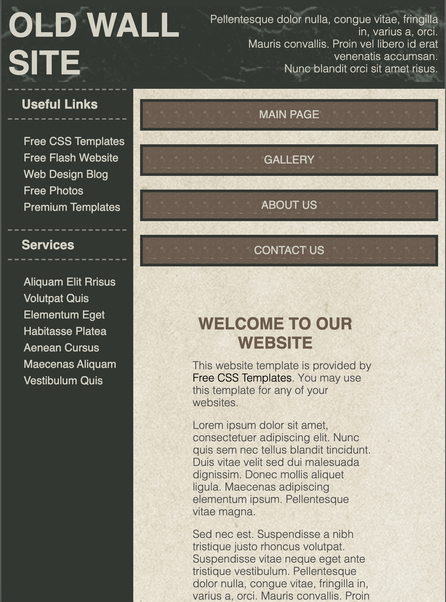

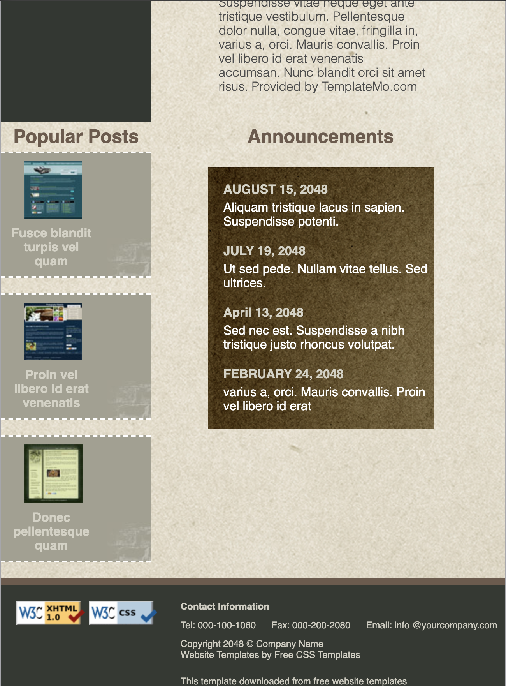

*Current desktop screenshot:*

## Acknowledgments

- **Billie Thompson** - *Provided README Template* -
    [PurpleBooth](https://github.com/PurpleBooth)